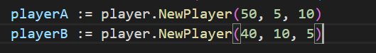
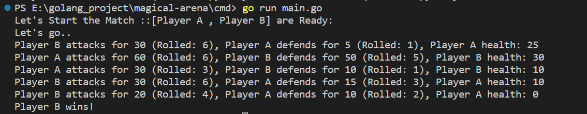
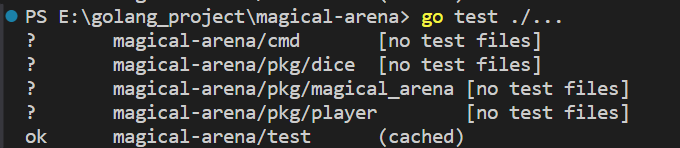

# Magical Arena

`Magical Arena is an exciting simulated battle arena where players engage in magical battles, strategically planning their moves to emerge victorious. The game also introduces an element of chance, as players rely on the roll of a die to determine their success.`


## Table of Contents

- [Introduction](#introduction)
- [Features](#features)
- [Project Structure](#project-structure)
- [Screenshots](#screenshots)
- [Testing](#testing)
- [Tech Stack](#tech-stack)
- [Developer](#developer)


## Introduction

In the Magical Arena, players face off in intense magical battles, each aiming to outsmart their opponent and be declared the ultimate victor. The strategic decisions made by each player play a crucial role in determining the outcome of the battles.

## Features

- **Strategic Gameplay:** Engage in battles that require thoughtful planning and strategic decision-making.
- **Element of Chance:** Test your luck with the roll of a die, adding an unpredictable and thrilling element to each encounter.


## Project Structure 

The project adheres to a standard Go project layout:

```plaintext
magical-arena/
|-- cmd/
|   |-- main.go
|
|-- pkg/
|   |-- player/
|       |-- player.go
|   |-- dice/
|       |-- dice.go
|   |-- magical_arena/
|       |-- magical_arena.go
|
|-- test/
|   |-- player_test.go
|   |-- dice_test.go
|   |-- magical_arena_test.go
|
|-- assets/
|   |-- images.png
|
|-- go.mod
|-- README.md
```

- **cmd/:** Contains the main application entry point.
- **pkg/:** Packages for player management, dice rolling, and arena logic.
- **test/:**  Unit tests for the respective packages.
- **assets/:** Contains .png images of Game Score for README.MD File


## Screenshots 

###### Image 01 :Let's Start Game : PlayerA & PlayerB is ready
```
Players |  Health   | Strength   | Attack
-----------------------------------------
Player A =  50           5         10
Player B =  40          10         5
```

###### Image 02 : Live Match Status & Final Result :


```
Hurray !!! Player B won the Game ..
```

## Testing 

Ensure the reliability of the code by running tests:

```
# Run tests for all packages in project directory
go test ./...

```

### Image :[Run Test]



## Tech Stack

**Programming Language:** Go <br>

## Developer

#### Saurabh Kumar

